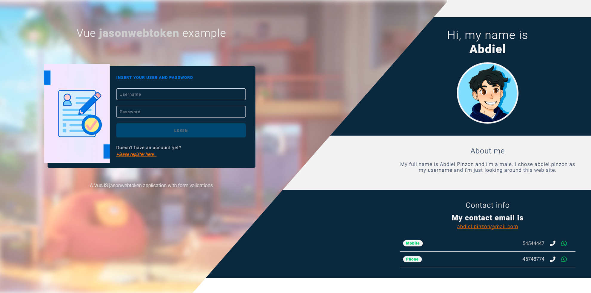
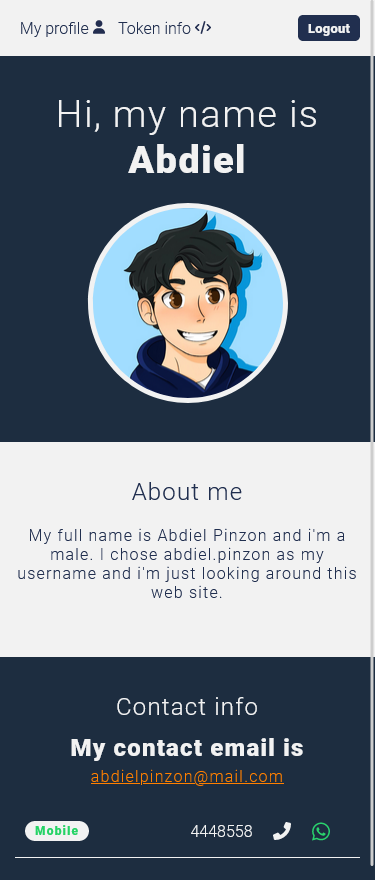

# vue-jsonwebtoken

A Jsonwebtoken application made in Vue 3. 

## Table of contents

- [Overview](#overview)
  - [About](#About)
  - [Screenshot](#screenshot)
  - [Live site](#Live-site)
- [How it works](#How-it-works)
  - [Built with](#built-with)
- [Author](#author)

## Overview

### About

A basic login application that implements jsonwebtokens to authenticate the user. It save the token in localstorage and persist sessions after closing the browser. (session token expires after 3 minutes)

This application implements Vue routing, Vuex, communication between components and reusable components as spinner and BaseInput components.

(BaseInput reusable component)
```vue
<template>
  <input
    class="input__style"
    :type="type"
    :placeholder="label"
    :value="modelValue"
    @input="$emit('update:modelValue', $event.target.value)"
  />
</template>

<script>
export default {
  name: "BaseInput",
  props: {
    type: {
      type: String,
      default: "Text",
    },
    label: {
      type: String,
      dafault: "",
    },
    modelValue: {
      type: [String, Number],
      default: "",
    },
  },
};
</script>

<style lang="scss" scoped>
.input__style {
  border: 1px solid var(--color-white);
  color: var(--color-white);
  letter-spacing: 1.2px;
  border-radius: 5px;
  background: none;
  padding: 10px;
}
</style>
```

### Screenshot





### Live site

- Live Site URL: [Live site](https://abdielp.github.io/vue-jsonwebtoken)

## How it works

There is a login form where user can login with and exisiting user. If user doesn't have an account, it can create one in the register form page.
Once user has loged in, there is a home page that shows user information and there is another page called 'token' that displays information about session and the jsonwebtoken.

### Built with

- Vuelidate
- Sweetalert2
- Mobile-first workflow
- CSS custom properties
- [Vue-CLI v3@](https://vuejs.org/) - JS library

- NodeJS Backend
- Express
- Express-validator
- jsonwebtoken
- Bcryptjs
- mongoose

## Author

- Frontend Mentor - [@AbdielP](https://www.frontendmentor.io/profile/AbdielP)
- GitHub - [@AbdielP](https://github.com/AbdielP)
- Twitter - [@abdiel262](https://twitter.com/Abdiel262)
